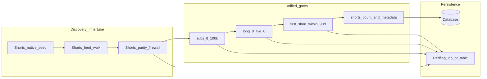

# ShortRadar — Final Build Report & Execution Guide

**Purpose:** One document to align vision, technical decisions, and a concrete build order so the product stops thrashing on crawler drift, gate mismatches, and unclear errors.

**How to use this file:** Work top to bottom in phases. Do not add product features until **Phase A** exit criteria are green.

---

## 1. Honest framing (read once)

- **This document is the stabilization blueprint.** It is designed to remove the structural reasons the system has been unreliable for years: multiple crawlers with different rules, feed pollution (long-form leaking in), and APIs that reject what crawlers thought was valid.
- **No honest engineer can promise “this is the last time you’ll ever suffer.”** YouTube and Innertube change; bugs happen. What this plan *does* promise is: **one contract**, **one pipeline**, **measurable health**, and **fast diagnosis** when something breaks again — so fixes are hours or days, not quarters.

If you only ship one thing, ship **Phase A**.

---

## 2. Product vision (what the SaaS must do)

**Audience:** Faceless Shorts creators looking for *winning niches*.

**Intended crawl behavior (canonical):**

1. Enter YouTube Shorts via **Innertube** (not a heavy browser loop) for RAM and throughput.
2. Obtain a **Shorts-native** entry (trending / feed seed), not a generic watch graph.
3. Build a **randomized traversal** that stays inside **Shorts feed context** (not “random YouTube”).
4. Scroll / walk the feed and **collect channel identities** from Shorts videos.
5. For each channel candidate, **only if**:
   - video/channel context is clearly Shorts,
   - channel has **&lt; 100k** subscribers,
   - channel has **0 long-form uploads** and **0 live** (strict “Shorts-only channel” definition),
   - **first Short** on the channel is within the **last 90 days** (rolling three months),
6. then fetch **shorts count + basic metadata** and **write to the database**.
7. Otherwise **skip** and **red-flag** with a **single explicit reason code** (no vague failures).

**Non-goals for v1 stability:** Maximizing channel count at the cost of purity; supporting mixed long+Shorts channels; multiple competing crawler philosophies in production.

---

## 3. Why things broke before (root causes)

These are the usual culprits in this codebase class of problem:

| Problem | Effect |
|--------|--------|
| **Multiple crawler entrypoints** (`cs_crawler`, `hyper_crawler`, legacy scripts) | Different seeds, different filters, impossible to reason about “what production does.” |
| **Gate drift** (crawler vs API / worker) | Crawler “passes” then downstream rejects — looks like random errors and wasted throughput. |
| **Regex / loose parsing of `videoId`** from huge JSON | Pulls IDs from unrelated parts of the tree → **long-form and random recommendations** leak in. |
| **Search or broad queries as primary seed** | Surfaces **huge, mixed-content** channels → mass rejects on subs / long / live. |
| **Static or mismatched date cutoffs** | “Old” vs “new” disagreements between layers. |
| **Poor observability** | Logs say “rejected” without a **stable reason taxonomy** → feels like the system is haunted. |

Fixing these is **more important** than swapping away from Innertube.

---

## 4. Innertube: keep or change?

**Recommendation: keep Innertube as the primary engine.**

- **Why:** Best balance of **throughput**, **RAM**, and **no full browser farm** for thousands of candidates per hour.
- **What to change:** Not the transport — the **constraints**:
  - Shorts-only structural acceptance (feed purity firewall).
  - One shared policy module for all gates.
  - Health metrics + circuit breakers when purity drops.

**Optional later (not v1):** A **tiny** headless browser sample (e.g. 1–2% of traffic) *only* to audit feed reality — not as the main crawler.

**Do not** rely on YouTube Data API v3 as the primary discovery engine if your goal is mass discovery at low cost; quotas and cost dominate.

---

## 5. Target architecture (minimal, stable)

**Rules:**

- **One production crawler path** (disable or archive others from deploy).
- **One gate implementation** imported by crawler **and** API/worker (same numbers, same date math).
- **Early cheap rejects** before expensive channel tab fetches where possible.

---

## 6. Canonical policy (numbers are law)

Implement **once** in shared code; import everywhere.

| Rule | Value |
|------|--------|
| Max subscribers | **99,999** (strictly less than 100k) |
| Long videos | **0** |
| Live videos | **0** |
| First Short age | **≤ 90 days** from `now` (rolling window) |
| Minimum Shorts on channel (if you keep this) | Define explicitly (e.g. ≥ 3) — **same** in crawler and API |

**Reason codes (stable strings):**  
`not_shorts_candidate`, `subs_over_limit`, `has_long_or_live`, `first_short_too_old`, `date_unknown`, `too_few_shorts`, `parse_error`, `network_error`, `duplicate_channel`.

Every skip must set **exactly one** primary reason (optionally secondary detail in metadata).

---

## 7. Shorts purity firewall (stops long-form drift)

**Intent:** Reject candidates that are not provably Shorts-context before they pollute the walk.

**Practical checks (combine as needed):**

- Video path / renderer indicates Shorts (e.g. `/shorts/{id}` semantics in parsed structure — not only “I found an 11-char id”).
- Do **not** treat “any `videoId` in JSON” as a Shorts video.
- Track ratio: `shortsCandidates / totalRawCandidates`. If ratio collapses, **reseed** or **pause** worker.

---

## 8. Observability & “stop getting errors”

**Product-level definition of healthy:**

- **Purity:** ≥ **95%** of raw candidates classified as Shorts-native (tune threshold after first week).
- **Consistency:** **100%** of rows inserted into DB satisfy **all** canonical gates (audit query).
- **Errors:** Bounded **network/parse** rate with backoff; spikes trigger alerts, not silent bad data.
- **Reason coverage:** **0%** “unknown” rejects in logs.

**Operational dashboards (minimal):** counts per `reason_code`, purity ratio, insert rate, error rate by type.

**Circuit breakers:** If purity &lt; X for N minutes or error rate &gt; Y, stop expanding crawl and reseed from a known-good Shorts entry.

---

## 9. Phased execution plan (what to build, in order)

### Phase A — Stabilization freeze (mandatory)

**Duration:** 7 days (calendar), no new features.

1. **Pick one production crawler** (recommendation: the path you actually run in Codespace/production most often; archive others from active deploy scripts).
2. **Add `packages/gates` or `lib/crawl-policy.mjs`** (name as you prefer): exports constants + `evaluateChannelGate(...)`.
3. **Wire crawler** to use only that module for all numeric/date rules.
4. **Wire API/worker** (`scraper-api`) to the **same** module (or duplicate-free build step if Worker bundling requires it).
5. **Implement Shorts purity firewall** on the chosen crawler (tighten ID extraction).
6. **Replace static “Dec 2025” style cutoffs** with **rolling 90 days** everywhere.
7. **Unify reason codes** in logs and API responses.
8. **30–60 minute** validation run → audit DB + reason distribution.
9. **24-hour soak** on one region/thread profile → confirm no drift.

**Phase A exit criteria:**

- Single pipeline live.
- No gate mismatch between crawler and API.
- Purity and reason metrics available.
- DB audit: zero violating rows.

### Phase B — Throughput hardening

- Backoff + jitter on Innertube failures.
- Dedupe keys for channel id / handle (normalize `@` vs `UC…`).
- Rate limits tuned to avoid mass 4xx/empty payloads (document chosen limits).

### Phase C — Product layer

- Only after A+B green: niche scoring, UI, billing, etc.

---

## 10. Final master checklist (copy into issues)

**Governance**

- [ ] Declare one “production crawler” and remove others from deploy/README.
- [ ] 7-day feature freeze for Phase A.

**Code**

- [ ] Shared gate module: subs, long, live, first-short 90d, min shorts (if any).
- [ ] Crawler uses shared module only (delete duplicate literals).
- [ ] API/worker uses shared module only.
- [ ] Shorts purity firewall + non-Shorts reason code.
- [ ] Rolling 90-day window (no accidental static cutoff drift).
- [ ] `date_unknown` path distinct from `first_short_too_old`.
- [ ] Idempotent DB writes + dedupe.

**Ops**

- [ ] Metrics: purity ratio, rejects by reason, errors by type, inserts/hour.
- [ ] Circuit breaker on purity/error spikes.
- [ ] 24h soak test sign-off.

---

## 11. What to tell yourself when it hurts again

You are not “bad at shipping.” You were fighting **moving targets without a frozen contract**. After Phase A, a regression looks like: **purity down**, **reason X up**, **specific commit or YouTube change** — not a two-year fog.

---

## 12. Document control

| Version | Date | Notes |
|---------|------|--------|
| 1.0 | 2026-03-25 | Initial consolidated report (vision, Innertube, architecture, phases, checklist). |

*End of report.*
